# Multiple Source Capture Recapture

This package implements a shiny user interface for multiple source capture recapture models. Multiple analysis types are supported, including:
* Log-linear models
* Bayesian model averaging 
* Bayesian latent class models.

Additionally, a power analysis calculator is provided for log-linear models.

## Introduction to Modeling

The basic idea behind capture recapture modeling is to run two or more surveys (capture events) and record the individuals who participate. If many people participate in multiple events, it is likely that you have recruited a significant chunk of the population. On the other hand, if no one appears twice. then we would likely conclude that the population is much larger than the sample we collected.

There are two fundamental concerns that arise capture recapture:

1. **List Dependence:** Ideally one would like to have all capture events be independent draws from the population. In many cases however, some capture events may be related. For example, in a city wide survey of injection drug users, it might happen that the first two capture events were more heavily concentrated in one area of the city than the third event.
2. **Capture Heterogeneity:** Ideally, each individual in the population has the same probability of being captured; however, some subgroups may have increased propensity for capture. For example, perhaps younger men who have sex with men are more likely to be captured at a venue (e.g. nightclub).

#### Dealing With List Dependence

List dependence is best dealt with using the Bayesian model averaging method, which will automatically detect potential dependencies.

#### Dealing With Heterogeneity

The Log-linear and Bayesian latent class methods both provide mechanisms to deal with individual heterogeneity. These are covered in more detail below. However, including heterogeneity in your model (regardless of the method) will greatly increase the uncertainty of your estimates, and it is often difficult to determine which of the potential models to use.

If there is significant heterogeneity, the recommended approach is to stratify the data into subgroups with more uniform capture probability, calculate population size estimates for the subgroups, and add them together to get an overall estimate. For example, if age is highly related to probability of capture, split the data into young and old individuals. Then calculate the estimated population size for the young and old separately. The overall population size is then the sum of the two estimates.

## Video Tutorial

### [Link To Tutorial](https://youtu.be/PgmyUnFlo5Y)

This is a tutorial for the analysis capabilities of the shinyrecap package.

Data used:

* https://fellstat.github.io/shinyrecap/data/brighton_total.csv
* https://fellstat.github.io/shinyrecap/data/brighton_male.csv
* https://fellstat.github.io/shinyrecap/data/brighton_female.csv
* https://fellstat.github.io/shinyrecap/data/brighton_male_15_29.csv
* https://fellstat.github.io/shinyrecap/data/brighton_male_30_44.csv
* https://fellstat.github.io/shinyrecap/data/brighton_female_15_29.csv
* https://fellstat.github.io/shinyrecap/data/brighton_female_30_44.csv

Data reference:

Hickman, M., Higgins, V., Hope, V., Bellis, M., Tilling, K., Walker, A., & Henry, J. (2004). Injecting drug use in Brighton, Liverpool, and London: best estimates of prevalence and coverage of public health indicators. Journal of Epidemiology & Community Health, 58(9), 766-771.

## R Package Installation

To install the latest development version from the github repo run the following in R:
```
# If devtools is not installed:
# install.packages("devtools")

devtools::install_github("fellstat/shinyrecap")

```

## Launching the Application

```
library(shinyrecap)

# Launch the Shiny application for multiple source capture re-capture
launchShinyPopSize()

# Launch the power analysis application
launchShinyPopSize("power")

# Launch the an application to help format your data for analysis
launchShinyPopSize("convert")
```

## Data Formatting

The analysis application works with data in "Capture History" format. Each column should represent a capture event and each row should be a capture history. Optionally the last column may be the count of individuals with that particular capture history. "1" indicates capture, and "0" indicates not captured, so the history
```
0 1 0 1
```
represents an individual who was captured in the 2nd and 4th event, but not the 1st or 3rd. A properly structured 3 event CRC dataset would look something like:
```
V1  V2  V3  count
1   0   0   3
0   1   0   8
1   1   0   4
0   0   1   6
1   0   1   2
0   1   1   2
1   1   1   1
```
From the first row `1	  0	  0	  3`, wee see that there were 3 individuals captured at event 1, but not at the 2nd and 3rd events. There was 1 individual captured in all 3 events (row: `1	  1	  1	  1`).

In many studies, particularly those in the epidemiological domain, don't collect data in this format. Rather, at each event, individual participation is recorded, along with information about whether they were captured in previous events. Thus, a 3 event CRC study would have three datasets. 

At the first event we count the number of participants
```
count
10
```

At the second event we count the number of participants, broken down by whether they participated in the first event.
```
V1  count
Yes 5
No  10
```

At the third event we count the number of participants, broken down by whether they participated in the first and/or second event.
```
V1  V2  count
Yes Yes 1
No  Yes 2
Yes No  2
No  No  6
```

Taken together, these three datasets are equivalent to the capture history dataset discussed above. `shinyrecap` provides a user interface to help perform the conversion in format.

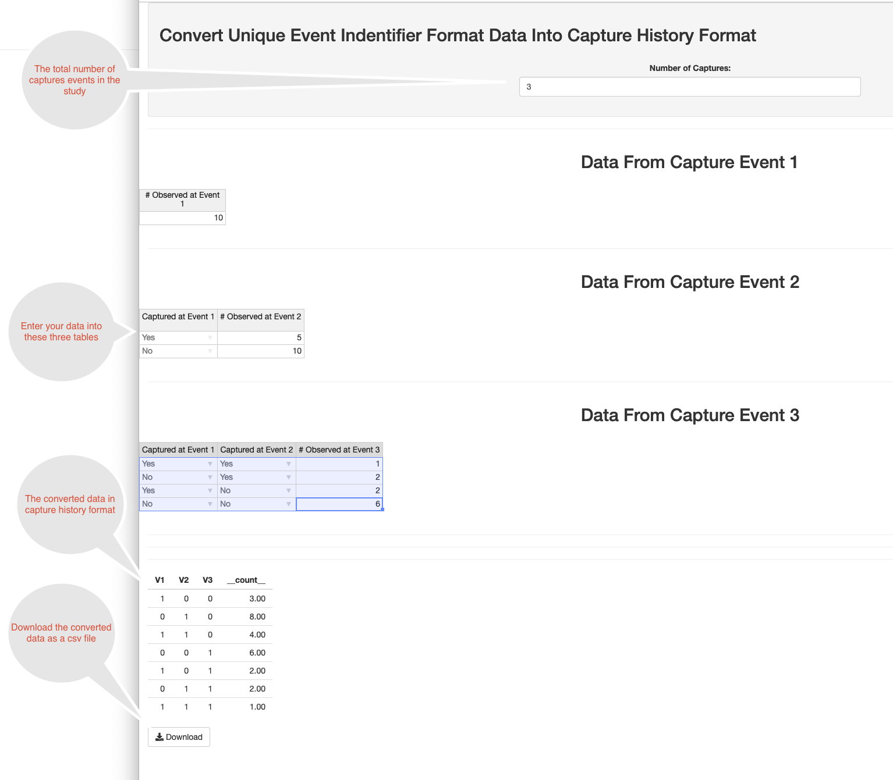

## Analysis Application Data Import

The first step toward performing an analysis is to load in the data. The application supports delimited text formats such as comma separated values (csv). Each column should represent a capture event and each row should be a capture history. Optionally the last column may be the count of individuals with that particular capture history.

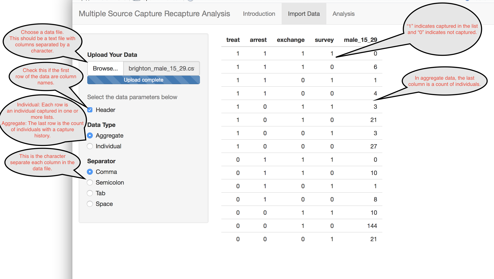

## Log-linear Models

This application supports four classes of log-linear models of varying model complexity.

* **M0:** The M0 model is the simplest possible multiple source capture recapture model. It assumes that there is no heterogeneity and that all capture events have the same probability of capturing individuals. Typically this is not the case in epidemiological studies.
* **Mt:**  This model relaxes the M0 model to allow for capture events to have different capture rates.
* **Mh:** This model relaxes the M0 model to allow for individual capture heterogeneity.
* **Mth:** This model allows for both heterogeneity and capture events having different rates.

When heterogeneity is present, there are different forms that this heterogeneity can take.

* **Normal:** The log odds of capture follows a Normal distribution.
* **Darrosh:** The log odds of capture _among those who were not captured_ follows a Normal distribution.
* **Poisson:** The log odds of capture _among those who were not captured_ follows a Poisson distribution.
* **Gamma:** The log odds of capture _among those who were not captured_ follows a Gamma distribution.

Selection between models is often done using either the AIC or BIC. For these, lower numbers indicate a "better" model fit. 

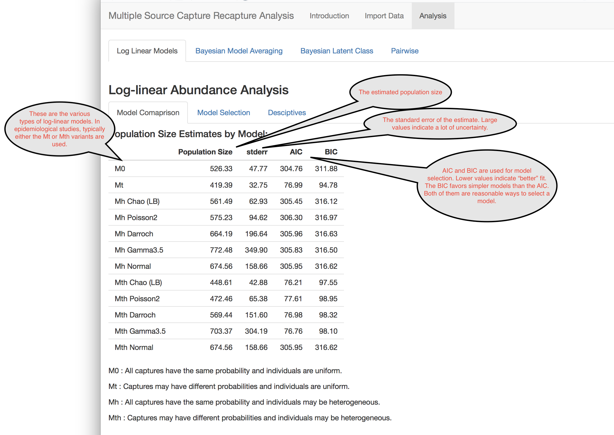

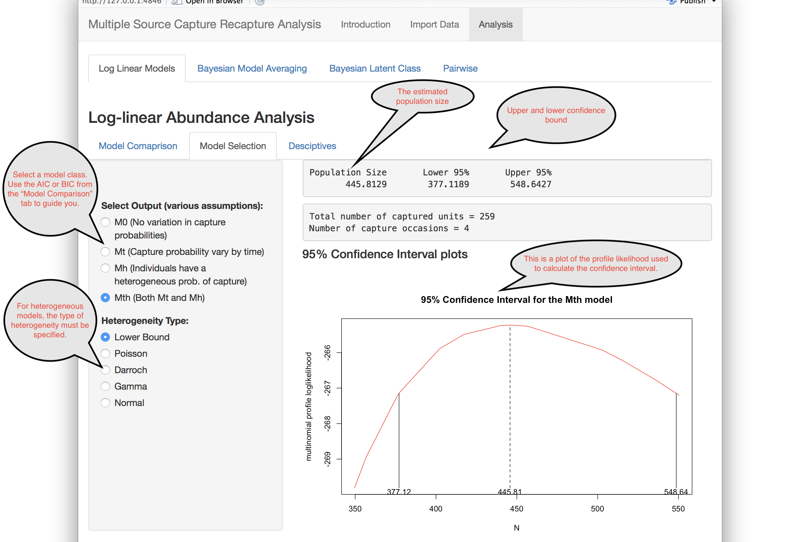

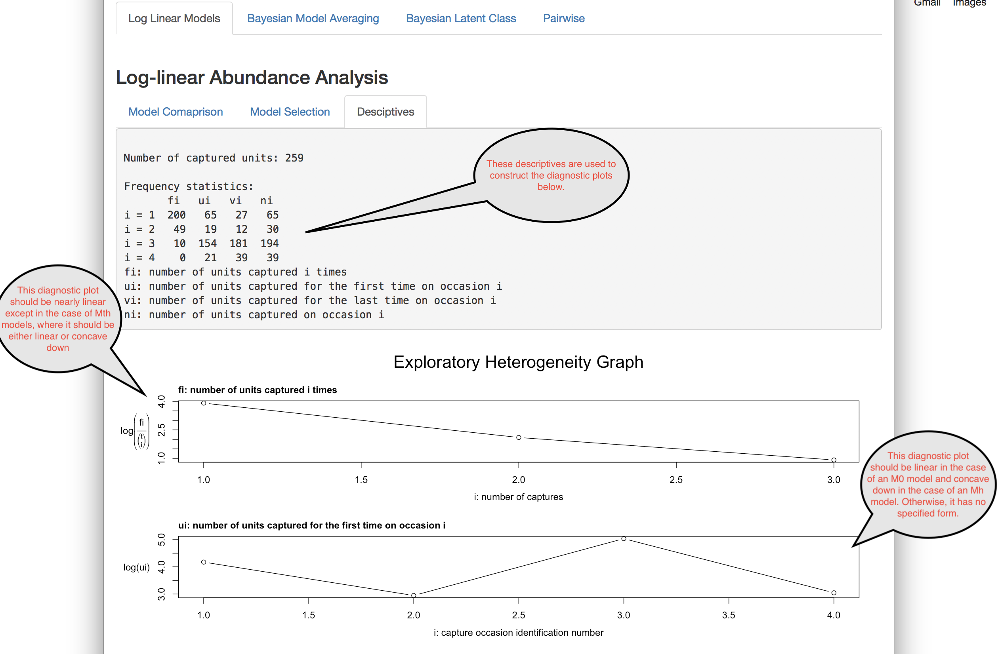

#### References
Louis-Paul Rivest and Sophie Baillargeon (2014). Rcapture: Loglinear Models for Capture-Recapture Experiments. R package version 1.4-2. https://CRAN.R-project.org/package=Rcapture

## Bayesian Model Averaging

This method allows the analyst to flexibly account for list dependency by creating models for all possible dependencies, and averaging over them in a way that is proportional to the probability that the dependence is correct.

The first step in the analysis is to formulate a prior for population size. This is represents the analyst's prior knowledge about population size along with uncertainty. By default, a "non-informative" prior is used. 

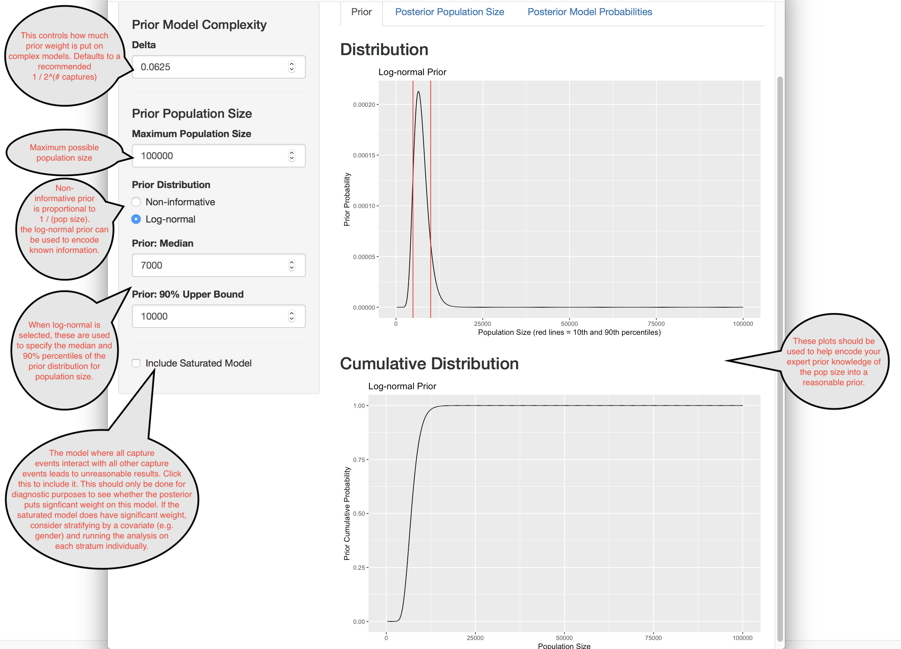

Once the prior is specified, the probability distribution of the population size can be calculated.

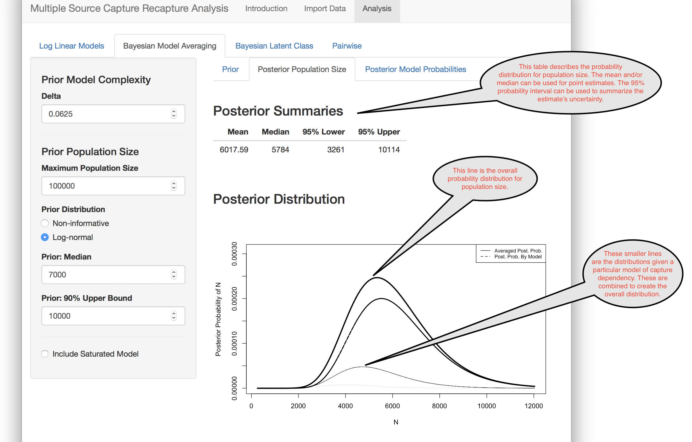

Finally, it is useful to examine what dependencies exist in your data. 

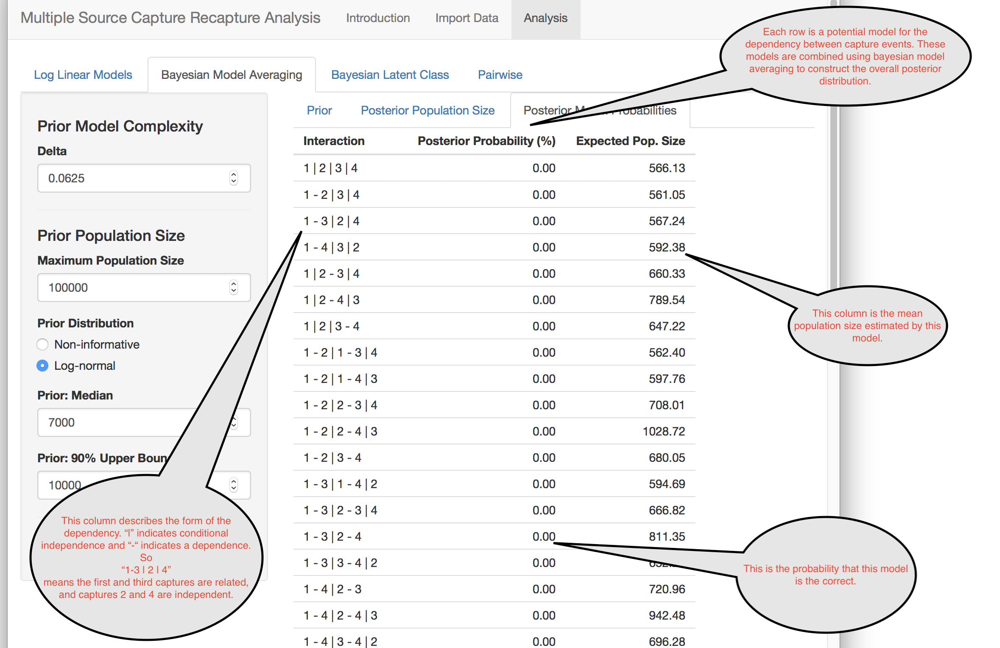

#### References

James Johndrow, Kristian Lum and Patrick Ball (2015). dga: Capture-Recapture Estimation using Bayesian Model Averaging. R package version 1.2. https://CRAN.R-project.org/package=dga

## Bayesian Latent Class

The Bayesian latent class model deals with heterogeneity in a novel way. It posits that there are unobserved subgroups in the data with different capture probabilities for each capture event. The number of these groups and their probabilities are unknown. The algorithm uses a Bayesian framework to estimates these, along with the population size.

The underlying algorithm is computationally quite complex and uses something called Markov Chain Monte Carlo (MCMC) to sample from the distribution of population size.

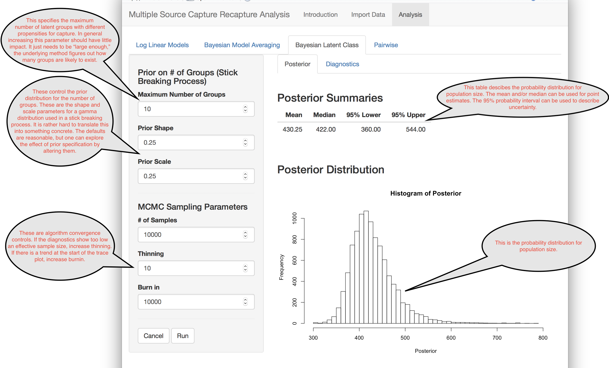
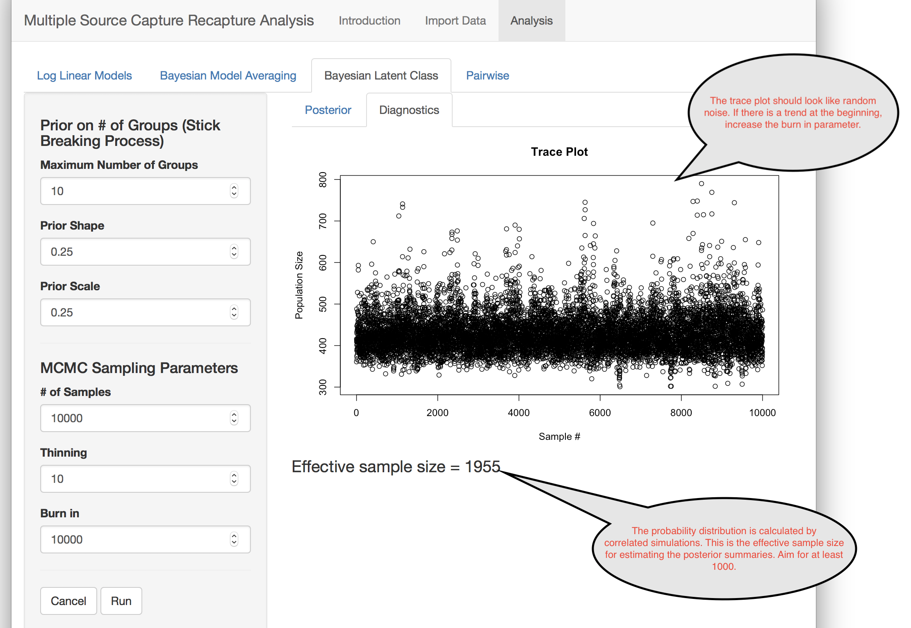

#### References
Daniel Manrique-Vallier (2017). LCMCR: Bayesian Non-Parametric Latent-Class Capture-Recapture. R package version 0.4.3. https://CRAN.R-project.org/package=LCMCR

## Pairwise

This tab shows population estimates using each pair of capture events. It can be useful to look at this as a diagnostic step. Ideally each pair should have similar estimates of population size.

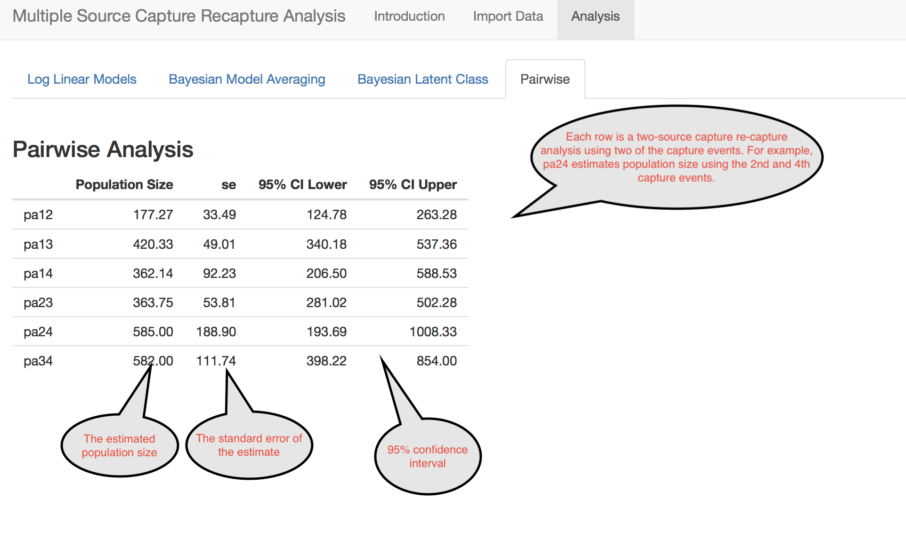


## Power Analysis

When planning a multiple source capture recapture study, it is useful to get an idea of how close your estimates of population size will be to their true value for given sample sizes. The power analysis lets you do this for log-linear modeling.

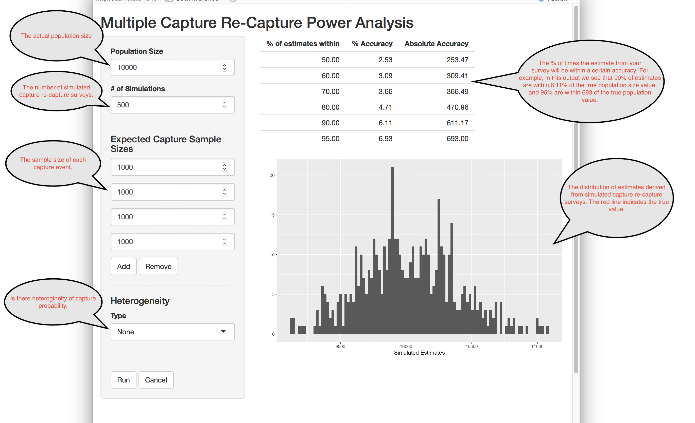


